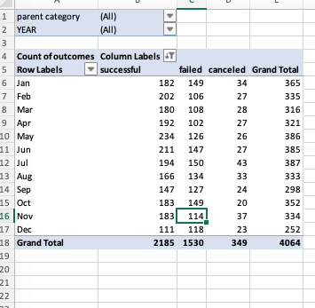
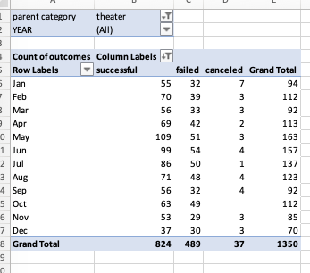
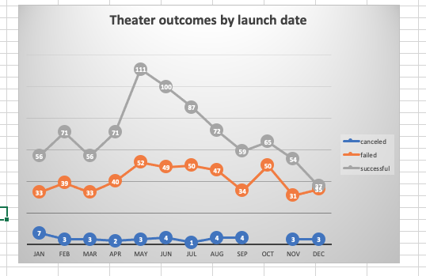
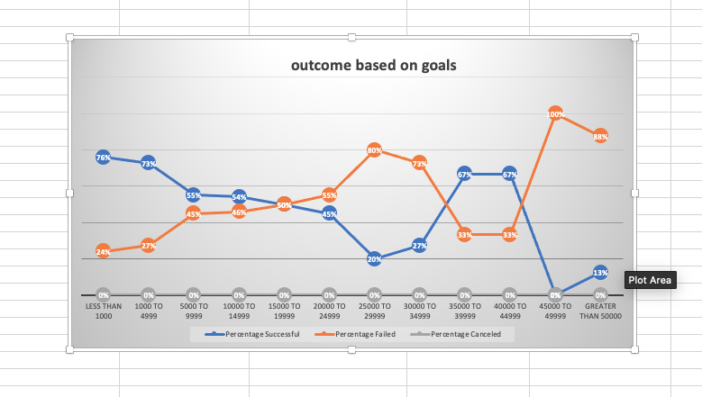

### OVERVIEW OF THE PROJECT

     ## Purpose:

     Louise’s play Fever came close to its fundraising goal in a short amount of time. Now, she wants to know how different campaigns fared in relation
     to their launch dates and their funding goals. Using the Kickstarter dataset I am going to help her visualize campaign outcomes based on their launch 
     dates and their funding goals. 
 

### Analysis and Challenges

     The first step of an analysis is to take an initial look at the data. The goal of this step is essentially to size up the data, 
     getting familiarize with it.

    ## Import data into a table for analysis.
     
         column A : "ID" 
         column B : "Name of the campaign"
         column C : "Description of campaign"
         column D : "Goal" (tells us how much money each campaign will need to succeed (in descending order))
         column E : "Pledged" (tells us how much each campaign actually made.)
         column F : "Percentage funded "(formula used =ROUND(E2/D2*100,0)) 
         column G : "Outcomes" (tells us if the campaign met its goal.)
         column H : "Country " (lists the country in which the campaign was started.)
         column I : "Currency" 
         column J : "Deadline" (unix timestamp)
         column K : "campaign launch at" (unix timestamp)
         column L : "Staff_pick" 
         column M : "Backers_count" 
         column N : "Spotlight" 
         column O : "Category and subtegories"
         column P : "Date Created Conversion"
         column Q : "YEAR" (formula used =YEAR(P2))
         column R : "Parent category" 
         column S : "subcategory"
         column T : "Average Donation" (formula used =IFERROR(ROUND(E2/M2,2),0))

        # Data Cleaning : By applying filters, conditional formatting, and formulas.

          Column (P) "Date Created Conversion" - To convert Unix timestamps to a more readable format, I inserted a new column (P) 
	  "Date Created Conversion" and used the formula =(K2/86400)+DATE(1970,1,1) where K2 is the first cell of campaign launch at.

           Column (F) "percentage funded" - Many of the campaigns missed their goal amount by a small margin. Instead of looking at both the Goal
	   and Pledged  columns to determine the deficit, a new column (F) "percentage funded"is created. This will help her to determine how close
	   a campaign came to reaching---and in some cases, exceeding---their funding goal.I aaplied a range of colors, based on the percentage funded , 
	   the maximum is colored blue and min colored red and midpoint is shadded transition from red to blue.

           In a perfectly curated dataset, shows projects which are fully funded by looking at the color grading alone.

           Our current dataset still has the color scheme, but if its scrolled down the sheet, I notice that there is quite a lot of a single color. 
	   and further more there is a color transition. This data provides a message : there is an outlier in the data set. An OUTLIER is a data point
	   that is abnormally high or low when compared to the rest of the data.

           column (T) "Average Donation" - Kickstarter, like other crowdfunding platforms, allows project creators to add incentives for different 
	   pledge amounts. I can help Louise set up her incentives by first determining how much money people have pledged to campaigns historically.
	   The first step is to create a column called "average donation" and use formula =ROUND(E2/M2,2).Our formula,uses data from the Pledged and
	   Backers column. However, not every campaign has backers, which means, in some cases, there is no number to divide by in the formula.

           Another Challenge is in data analysis is errors.While this error doesn't hinder our research, we can and should clean it up.

           The new column (Average Donation) created has errors, so needs to be fixed in order to present a clean analysis. The process of researching an 
	   error and incorporating its solution is called debugging.

           The formula used is =IFERROR(ROUND(E2/M2,2),0).

           Because Louise is interested in starting a campaign for theater, let's filter the worksheet to show only theater campaigns in 
	   the Category/Subcategory column.There's a column in the worksheet named "Category and Subcategory," which groups a main category 
	   (such as "film and video")
	   with all of its subcategories (like science fiction, drama, animation, and so on). We can make our data more detailed by splitting the Category
	   and Subcategory column into two distinct columns: "Parent category" and "Subcategory." This gives us additional data to use in our analysis.
	   While looking at the theater data as a whole has been helpful, including more data will make our analysis even more detailed and thus 
	   generate additional insight.

### RESULTS

    ## Analysis of Outcomes Based on Launch Date

         To do the analysis I have used Pivot Table.It is a powerful Excel tool that condenses data into a summary that delivers information 
	 where we can analyze and then tweak it with visual customizations.

         -A pivot table from the KickStarter worksheet is created and place the pivot table in a new sheet.
         
         -Its labelled as "Theater Outcomes by Launch Date."
         
         -Pivot table is filtered based on "Parent Category" and "Years.
         
         -Column labels are filtered to show only "successful," "failed," and "canceled."
         
         -The pivot table looks like this:

     

	 
	 

         - Filter the "Parent Category" to show only the data for "theater."

         - Sort the campaign outcomes in descending order so "successful" is first.
         
         - The final pivot table looks like the following.

         - The following shows the line graph from pivot table. The X- axis represents months of years and the Y- axis represents number of 
	 theater outcomes.From this graph I can predict which month of year I can expect what type of outcome. 

 

     
        # What are two conclusions you can draw about the Outcomes based on Launch Date?

          INTEPRETATION : 

          Conclusion 1: Total successful is 839 , failed 493 and cancelled 37 out of grand total 1369 if I considered Parent category as "Theater" 
	  for all years . So, the success rate is more than failed and cancelled when the parent category is "theater"

          Conclusion 2: The month that launched the most successful Kickstarter campaigns was May. However, January, June, July and October all had 
	  roughly the same number of failed campaigns launched. Also during December none of the campaign were successful and they were failed. So ,
	  the best time for her to do campaign to be successful should be month of May.

    ## Analysis of Outcomes Based on Goals
  

         I used Excel skills to visualize the percentage of successful, failed, and canceled plays based on the funding goal amount.For this I used 
	 a new function, COUNTIFS(), to collect the outcome and goal data for the “plays” subcategory.

         - In the KickStarter sheet, new sheet is created and labelled it "Outcomes Based on Goals."
         - Then ,created the following columns to hold the data:
          Goal
          Number Successful
          Number Failed
          Number Canceled
          Total Projects
          Percentage Successful
          Percentage Failed
          Percentage Canceled

         - In the “Goal” column, created the following dollar-amount ranges so projects can be grouped based on their goal amount.

         Used COUNTIFS() functions to populate the "Number Successful," "Number Failed," and "Number Canceled" columns by filtering on the
	 Kickstarter "outcome" column, on the "goal" amount column using the ranges created in Step 3, and on the "Subcategory" column using 
	 "plays" as the criteria.
	 
         Used the SUM() function to populate the "Total Projects" column with the number of successful, failed, and canceled projects for each row.

         Calculated the percentage of successful, failed, and canceled projects for each row.

         Now created a line chart titled "Outcomes Based on Goal" to visualize the relationship between the goal-amount ranges on the x-axis and the 
	 percentage of successful, failed, or canceled projects on the y-axis.The line chart looks like the following:

		 

 

        # What can you conclude about the Outcomes based on Goals?

         Conclusion :
         
         For Outcome to be successful 

            maximum success 76%-73% - goal range is upto 4999 
            minimum success 0 % - goal range is 45000-49999
        

         For outcome to be failed 
          
            maximum failed 100% - goal range is 45000-49999
            minimum failed 24 % - 27 %  - goal range is upto 49000
            

         when goal is upto 4999, success rate is max while when the goal is between 45000 - 49999 the failure is 100% (maximum)

         So, to conclude for Louise who wants to do a play in theater , the best range of goal to be successful is between 1000-4999. She will have to keep her budget below 4999, so that can can be successful 

     ## What are some limitations of this dataset?

          The limitations could be various such as country (column H) or launching date , or deadline date.

     ## What are some other possible tables and/or graphs that we could create?

       The other possible tables or graph could be is bar chart, histogram, pie chart to present this dataset.

