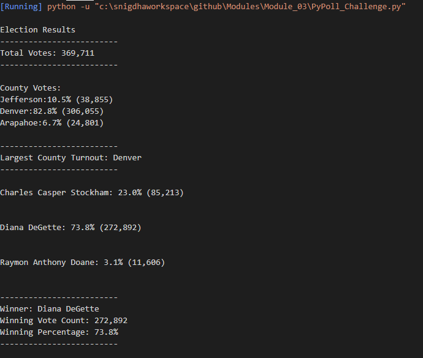

# Modules
U of T Bootcamp assignment - module 3 
# PY Poll Election Analysis 

##Overview of Election Audit

The purpose of this election audit analysis:

The voter turnout for each county
The percentage of votes from each county out of the total count
The county with the highest turnout

##Election-Audit Results: 

Following is the list of election outcomes:

- There were 369,711 votes cast in the election.

-  The candidate results were:
	- Jefferson received **_10.5%_** of the vote and _38,855_ number of votes.
	- Denver received **_82.8%_** of the vote and _306,055_ number of votes.
	- Arapahoe received **_6.7%_** of the vote and _24,801_ number of votes.

- The country which has largest number votes is Denver

- The candidates were:
	- Charles Casper Stockham
	- Diana DeGette
	- Raymon Anthony Doane
  
* The candidate results were:

	- Charles Casper Stockham received **_23.0%_** of the vote and _85,213_ number of votes.
	- Diana DeGette received **_73.8%_** of the vote and _272,892_ number of votes.
	- Raymon Anthony Doane received **_3.1%_** of the vote and _11,606_ number of votes.
  
- The **winner** of the election was:

    **Diana DeGette**, who received **272,892** number of votes, **73.8%** of the total votes cast in the election.
    

##Election-Audit Summary:

- This code is written in generalized way and can be used for any election.
