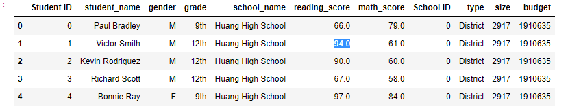
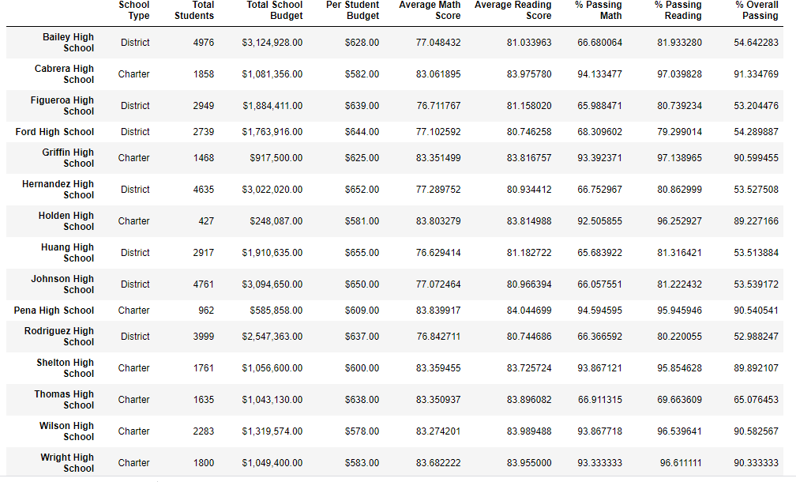
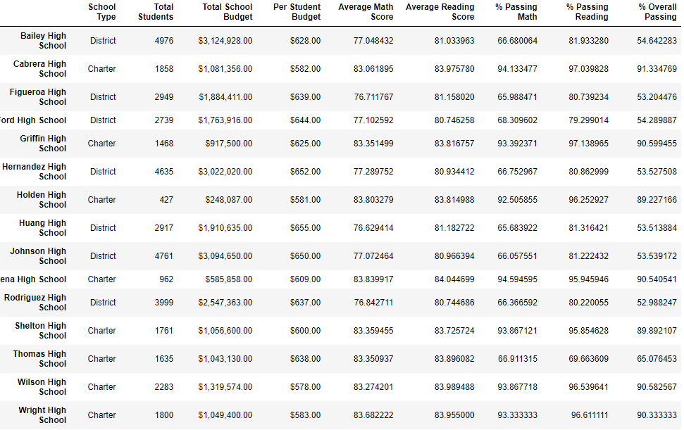

# Overview of the school district analysis:

 Use of Python and Pandas library to analyze school district data and trends in school performance

- Create the district and school summary DataFrames.
- Calculate the top 5 and bottom 5 performing schools.
- Calculate the average math and reading score for students in each grade level at each school.
- Calculate the school performance based on the spending per student.
- Calculate the school performance based on the size of the school.
- Calculate the school performance based on the type of school.

# Summary: 

Using bulleted lists and images of DataFrames as support, address the following questions.

## How is the district summary affected?

The Average reading score is bit higher than Average math score . 
It is 81.85579580976001in reading score and 78.93053295099331 for math score .
The passing reading count is 33158 , while passing math count 28939. out of overall percentage , math percentage is lower than reading .

## How is the school summary affected?

Thomas High school was originally placed at second based on % overall passing, but not even in top 5 anymore after changing. The average score stays the same at 83.4 from math, and increases from 83.8 to 83.9 for reading; however, percetages all go down from 93 to 67 for passing math, and 6 to 4 for passing reading, and 91 to 65 for overall passing.

## How does replacing the ninth graders’ math and reading scores affect Thomas High School’s 

The ranking of Thomas High school dropped from 2nd to 13th amoung total 15 schools.

## How does replacing the ninth-grade scores affect the following:

- by School Spending: The average math and reading stays the same for all school spendings, but % goes down particularly for the school Spending range $630 ~ 644 from 73 to 67 for passing math, and from 63 to 56 for overall passing.

- by School Size: The average math and reading stays the same for all school sizes, but % goes down particularly for the school size Medium (1000~2000) from 94 to 88 for passing math, and from 6 to 5 for passing reading, and from 91 to 85 for overall passing.

- by School Type: The average math and reading stays the same for both school types, but % goes down particularly for the school type Charter from 94 to 90 for passing math, and from 90 to 87 for overall passing.

