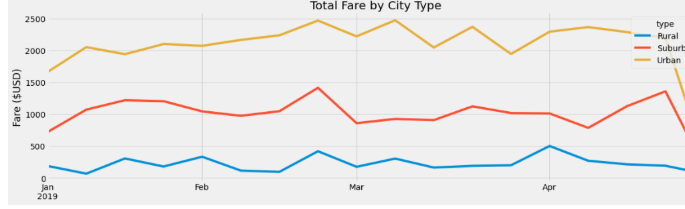

# Overview

To create a summary DataFrame of the ride-sharing data by city type. 
The purpose of this project is to perform analysis of Pyber ride sharing data to findout the comparison between ridership and fare metrics by the types of cities in which Pyber operates. creating visualizations of rideshare data for PyBer to help improve access to ride-sharing services and determine affordability for underserved neighborhoods.

# Results
There is a description of the differences in ride-sharing data among the different city types. Ride-sharing data include the total rides, total drivers, total fares, average fare per ride and driver, and total fare by city type. 

- Urban cities have the highest ridership demand while rural cities have the least.
- Urban cities have more drivers than suburban cities.
- Suburban cities have drivers than rural with almost the revenue.
-  Rural cities have the highest average fare per ride and driver.
- The summary data shows a relationship in which fare revenue is higher by city type when there is a larger ratio of drivers to rides.

# Summary

Based on the analysis my business recommendations to Pyber are: Increasing the amount of drivers in Rural areas to ensure there are enough drivers to meet ride demand. Data for rural cities shows that the average fare per ride and average fare per driver is much higher than Suburban and urban cities.This can indicate that rural area based riders are taking trips over a longer distance. This can result in a majority of drivers being occupied with current trips and loss in potential revenue when there are peaks in business.

