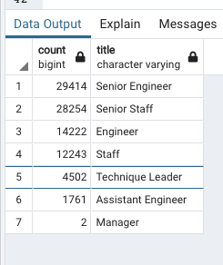

# Overview of the analysis:

The purpose of the new analysis is to write an analysis to help prepare Bobby’s manager for the “silver tsunami” as many current employees reach retirement age.He wants to determine the number of retiring employees per title, and identify employees who are eligible to participate in a mentorship program.

# Results:

- With SQL I created a retirement_info table that holds all the titles of current employees who were born between January 1, 1952 and December 31, 1955. 

- Because some employees may have multiple titles in the database—for example, due to promotions—I used the DISTINCT ON statement to create a table retirement_info  that contains the most recent title of each employee. 

- Then, I used the COUNT() function to create a final Retiring_Titles table that has the number of retirement-age employees by most recent job title.

- Then, I created a mentorship-eligibility table that holds the current employees who were born between January 1, 1965 and December 31, 1965.They are who are eligible to participate in a mentorship program.

# Summary:

- How many roles will need to be filled as the "silver tsunami" begins to make an impact?

All the senior position are going to retire soon and they need to be filled.

- Are there enough qualified, retirement-ready employees in the departments to mentor the next generation of Pewlett Hackard employees?

-57688 senoir eng /saff to retire enough qualified to mentor the next generation 32730 employees.

