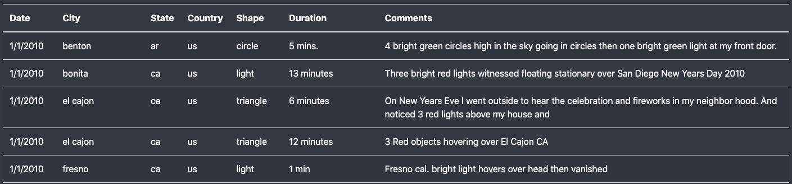
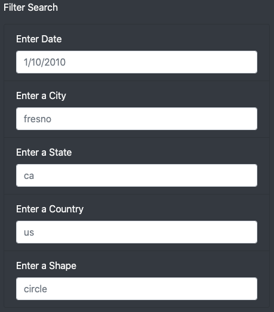
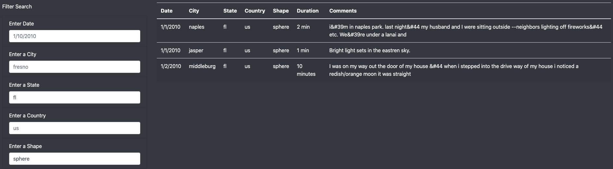

# UFOs

## Table of Contents
- [Overview of Analysis](#overview-of-analysis)
- [Analysis Results](#analysis-results)
  - [Example Search](#example-search)
- [Summary](#summary)

## Overview of Analysis

The purpose of this analysis is to assist a UFO enthusiast client in visualizing UFO sighting in a nice webpage and also filter based on various factors such as date of sighting, country, alleged UFO shape and others.

## Analysis Results

The site was created for fellow UFO enthusiasts where information of various UFO sighting were seen, mostly in the US. An excerpt written by the client was added into the HTML.

Under the excerpt is a table with information on various sightings and information such as the date, city, state, country, shape, duration and comments on the sightings. The first five entrees can be seen in figure 2. A filter section is available for those who visit the page to filter through the table based on their preference as shown in figure 3. 

**_FIGURE 1.

**_FIGURE 2. 

**_FIGURE 3. 

### Example Search

Below is an image showing an example filter process showing sighting in Florida ("fl"), United States where the shape of the UFO seen was identified as a "sphere".

**_FIGURE 4. 

## Summary

Although the HTML is clean and organized, there is still more that can be done with it. One drawback that can be identified with the design is a link to more information and possible pictures for as many sightings as possible. This would give the page visitors more information and would make the page more interesting to visit. This could be done by:
- Allocating UFO sightings to each row in the table and subsequently adding an `<a href="" />` tag to provide more information and possible comments from those who was present at the time.
- Including any images taken at the time of the sighting. These images can either be included in the table or added to a new linked page if created.

